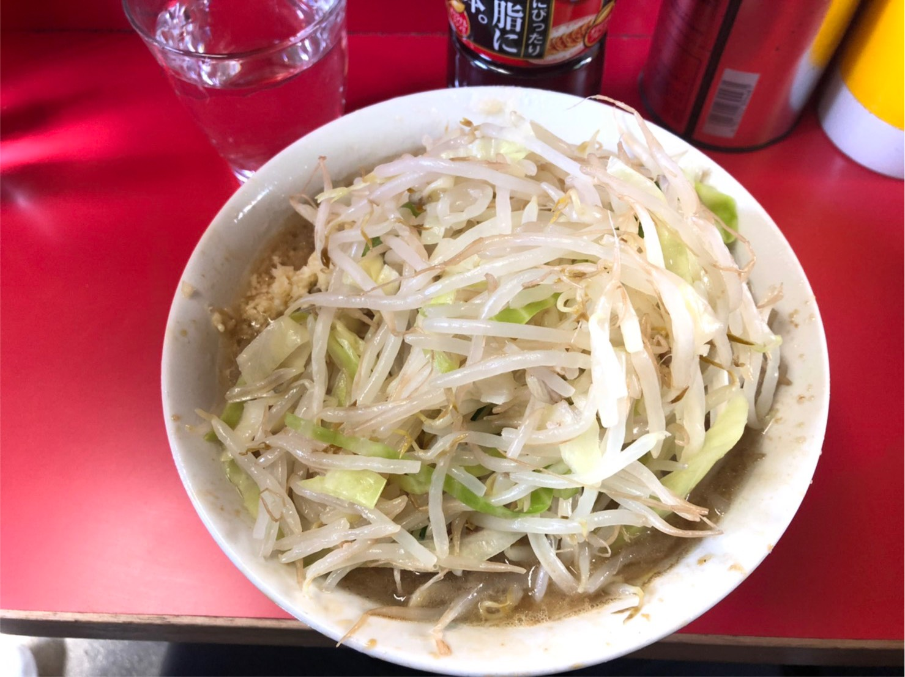

# 最初の投稿

ラーメンラーメン！ ラーメンラーメン！ ラーメンラーメン！ ラーメンラーメン！

- [らーめんへジャンプ](#lamen)

## 星野みなみ

## らーめん

## 写真の埋め込み

結構工夫をして埋め込む必要があった。

最近ではTwitterやinstegramから埋め込み用HTML片を用意して貼った方が良さげ

<blockquote class="twitter-tweet">
hoo <a href="https://t.co/VVg1u2vWmh">pic.twitter.com/VVg1u2vWmh</a>
&mdash; ここいち (@1akC74V9br5ddNO) <a href="https://twitter.com/1akC74V9br5ddNO/status/1386244685073588228?ref_src=twsrc%5Etfw">April 25, 2021</a></blockquote> 

## 疑問

時間変わらんなぁ

## ドキュメント
[みなみ.pdf](minami.pdf)  
[wikipedia](https://ja.wikipedia.org/wiki/%E6%98%9F%E9%87%8E%E3%81%BF%E3%81%AA%E3%81%BF[wikipedia])
